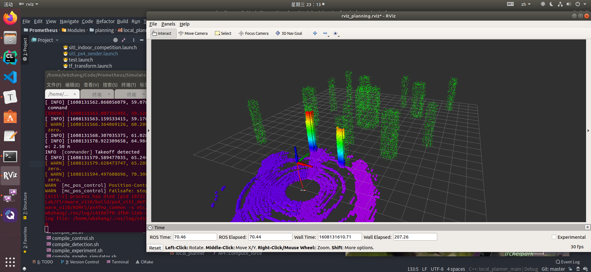

# 阿木实验室prometheus_notes

> [项目主页](https://github.com/amov-lab/Prometheus) :happy:

## 1.项目安装与配置

1. 项目编译

```bash
cd /home/wbzhang/Code/Prometheus
sudo chmod 777 ./compile_all.sh  #(第一次运行才需要执行此赋权命令)
./compile_all.sh
```

配置环境变量

```bash
echo "source /home/wbzhang/Code/Prometheus/devel/setup.bash" >> ~/.bashrc
source ~/.bashrc
```

2. 安装阿木改编的px4固件

```bash
# 环境变量配置
source ~/Code/Prometheus/devel/setup.bash
export GAZEBO_PLUGIN_PATH=$GAZEBO_PLUGIN_PATH:~/Code/Prometheus/devel/lib
export GAZEBO_MODEL_PATH=$GAZEBO_MODEL_PATH:~/Code/Prometheus/Simulator/gazebo_simulator/models
source ~/Code/AmovLab/Firmware_v110/Tools/setup_gazebo.bash ~/Code/AmovLab/Firmware_v110 ~/Code/AmovLab/Firmware_v110/build/px4_sitl_default
export ROS_PACKAGE_PATH=$ROS_PACKAGE_PATH:~/Code/AmovLab/Firmware_v110
export ROS_PACKAGE_PATH=$ROS_PACKAGE_PATH:~/Code/AmovLab/Firmware_v110/Tools/sitl_gazebo

```


## 2.prometheus_sitl_gazebo

### 2.1 gazebo_simulator

```bash
# 0.prometheus项目目录
cd /home/wbzhang/Code/Prometheus

# 1-进入SITL仿真
# 官方px4仓库
cd ~/Firmware/
# amulab仓库
cd ~/Code/AmovLab/Firmware_v110/
DONT_RUN=1 make px4_sitl_default gazebo
source /home/wbzhang/Code/Prometheus/devel/setup.bash # (optional)
source Tools/setup_gazebo.bash $(pwd) $(pwd)/build/px4_sitl_default
export ROS_PACKAGE_PATH=$ROS_PACKAGE_PATH:$(pwd)
export ROS_PACKAGE_PATH=$ROS_PACKAGE_PATH:$(pwd)/Tools/sitl_gazebo

# 启动SITL仿真
roslaunch prometheus_gazebo sitl_apf_3Dlidar.launch
roslaunch prometheus_gazebo sitl_apf_hokuyo.launch
roslaunch prometheus_gazebo sitl_apf_rgbd.launch

# 3d nav goal替代指令
rosrun prometheus_mission pub_goal

```

### 2.2 改编版固件控制方式

1.终端控制

```bash
# prometheus_终端控制
rosrun prometheus_control terminal_control
```

2.键盘控制：似乎失效

```bash
rosrun prometheus_gazebo keyboard_control_px4.py
#在QGC中如下配置
RC2_TRIM = 1000us
COM_FLTMODE1 = Position
RC_CHAN_CNT = 8
RC_MAP_FLTMODE = Channel 5
RC_MAP_PITCH = Channel 3
RC_MAP_ROLL= Channel 1
RC_MAP_THROTTLE = Channel 2
RC_MAP_YAW = Channel 4
```


### 2.3 demo测试

#### APF算法避障测试

apf_3dlidar的效果如下：


#### VFH_3dliar避障算法效果测试


##### VFH_3DLidar demo剖析

1) launch文件解析

主要包括：`使用特定飞机机器和模型启动sitl仿真`、`启动局部规划算法prometheus_local_planning->local_planner_main节点，并设定算法参数`、`启动任务规划prometheus_mission->planning_mission`以及`rviz展示`

```xml
<launch>
    <!-- Launch Gazebo Simulation -->
    <arg name="x" default="0.0"/>
    <arg name="y" default="-10.0"/>
    <arg name="z" default="0"/>
	<arg name="world" default="$(find prometheus_gazebo)/worlds/obstacle.world"/>
	<arg name="sdf" default="$(find prometheus_gazebo)/models/P300_3Dlidar/P300_3Dlidar.sdf"/>
	<arg name="model" default="P300_3Dlidar"/>
    <include file="$(find prometheus_gazebo)/launch/sitl.launch">
	  <arg name="world" value="$(arg world)"/>
	  <arg name="sdf" value="$(arg sdf)"/>
	  <arg name="model" value="$(arg model)"/>
      <arg name="x" value="$(arg x)"/>
      <arg name="y" value="$(arg y)"/>
      <arg name="z" value="$(arg z)"/>
    </include>

	<!-- 设定局部点云话题-->
	<arg name="topic_of_local_pcl" default="/prometheus/sensors/3Dlidar_scan"/>
	<!-- 启动局部规划算法 -->
	<node pkg="prometheus_local_planning" name="local_planner_main" type="local_planner_main" output="screen">
		<remap from="/prometheus/planning/local_pcl" to="$(arg topic_of_local_pcl)" />
		<!-- 选择算法 0代表APF,1代表VFH -->
		<param name="planning/algorithm_mode" value="1" type="int"/>
		<!-- 激光雷达模型,0代表3d雷达,1代表2d雷达 -->
		<param name="planning/lidar_model" value="0" type="int"/>
		<!-- 最大速度，设的越小越安全 -->
		<param name="planning/max_planning_vel" value="0.1" type="double"/>
		<!-- 膨胀参数，一般设置为无人机的半径或更大 -->
		<param name="vfh/inflate_distance" value="0.6" type="double"/>
		<!-- 感知距离，只考虑感知距离内的障碍物 -->
		<param name="vfh/sensing_distance" value="1.5" type="double"/>  
		<!-- weight -->
		<param name="vfh/obstacle_weight" value="10.0" type="double"/>
		<param name="vfh/goalWeight" value="0.1" type="double"/>
		<param name="vfh/safe_distance" value="0.01" type="double"/>
		<!-- 直方图个数 -->
		<param name="vfh/h_res" value="360" type="int"/>
	</node>	

	<!-- 启动规划mission， 激光输入control_yaw_flag设为false，rgbd输入control_yaw_flag设为true -->
	<node pkg="prometheus_mission" type="planning_mission" name="planning_mission" output="screen" launch-prefix="gnome-terminal --">	
		<param name="planning_mission/control_yaw_flag" value="false" type="bool"/>
	</node>

	<!-- 启动rviz,设为false可关闭 -->
	<arg name="visualization" default="true"/>
	<group if="$(arg visualization)">
        <node type="rviz" name="rviz" pkg="rviz" args="-d $(find prometheus_gazebo)/config/rviz_config/rviz_planning.rviz" />
        <!-- obstacle.world 真实点云 -->
        <node pkg="prometheus_slam" type="pc2_publisher_node" name="pc2_publisher_node" output="screen">	
		    <param name="pcd_path" type="string" value="$(find prometheus_gazebo)/maps/obstacle.pcd" />
	    </node>
    </group>
</launch>
```

2) SITL仿真启动

包括模型选择、估计器参数选择（可选EKF2_VISION或者GPS），仿真速度因子。px4的配置，包括启动px4和gazebo，插入模型节点`spawn_model`，启动mavros节点`mavros_node`，`发布TF变换节点`，然后启动<font color=red>prometheus的姿态估计和控制节点</font>。启动`地面站ground_station`、`ground_station_msg`节点。

3) 


#### A*算法全局路径规划测试


#### FAST_PLANNER_3dlidar测试


#### HYBRID_ASTAR_3DLIAR


#### motion_planning


#### swarm_planning_groundtruth


#### swarm_control_3uavs


#### swarm_control_5uavs


#### slam_octomap




#### cartorgrapher_rplidar


#### 2.4 自主着陆导航demo


仿真流程

- 运行启动脚本(静止目标) 

  ```bash
  roslaunch prometheus_gazebo sitl_landing.launch
  ```

- 运行启动脚本(移动目标)

  ```bash
  roslaunch prometheus_gazebo sitl_landing_moving_target.launch
  ```

- 启动后，输入1启动自动降落任务，飞机将起飞至起始点

- 对于移动目标，待飞机起飞完毕后，新开一个窗口运行以下指令控制小车移动 

  ```bash
  rosrun prometheus_gazebo move_landing_pad.py
  ```

- 飞机将持续读取图像信息，结果可在终端查看，并可与真值进行比较。如丢失图像信息，飞机将会悬停在当前点 

- 当飞机与降落板位置小于阈值时，飞机将自动上锁，完成任务


## 3.仿真系统架构

以下为例，可见主要由`mavros`命名空间，`tf`以及`自定义prometheus`命名空间以及`gazebo和规划器,`还有`地面站`等构成.

重要节点分析如下：

---

##### 控制部分

1) 控制器的位置估计节点：从`mavros`和`gazebo`订阅飞控fcu的状态量，包括imu、状态state、位置、速度等等。

2) 控制器的`位置外环控制`节点：**订阅**导航坐标系(local)下的目标位置、目标姿态、当前无人机的状态、控制指令；由控制策略处理，并发布mavros消息`attitude`和`local`来控制无人机

---

##### prometheus任务部分

1) drone_trajectory与drone_odom:无人机的轨迹与里程计

2) local_planner: 局部位置估计和主要消息？？订阅传感器信息、目标、局部规划器的开关swtich、以及里程计信息（即无人机当前状态）；处理并发布期望速度到desired_vel

3) 传感器:gazebo插件发布传感器消息

4) 任务相关：订阅planning/goal目标、期望速度desired_vel、停止命令、无人机状态drone_state；发布控制指令control_command、message_main

---


